- Objetivo
Participamos de un escenario de purple team donde trabajamos junto a un pentester para detectar y prevenir la ejecución de malware en estaciones de trabajo simuladas dentro de una empresa ficticia llamada PicoSecure. Nos apoyamos en el modelo de la Pirámide del Dolor (Pyramid of Pain) para escalar en complejidad y efectividad nuestras detecciones.

- Herramientas utilizadas
    Malware Sandbox

    Gestor de Hashes

    Firewall Manager

    DNS Filter

    Sigma Rule Builder

- Descripción de los pasos

- Sample 1 – Hash

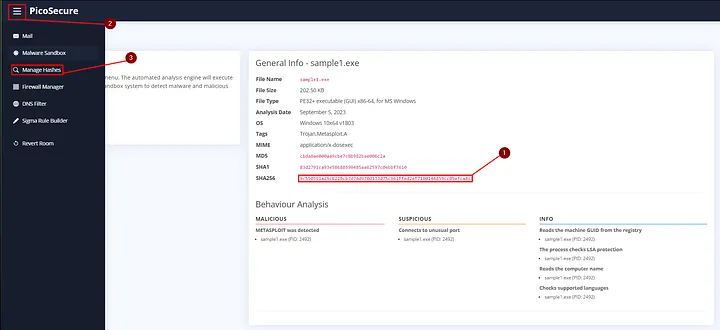

    Se analiza sample1.exe en el sandbox.

    Se copia el hash SHA256 y se agrega a la lista de bloqueo.

    Esto previene su ejecución.

Flag: THM{f3cbf08151a11a6a331db9c6cf5f4fe4}

- Sample 2 – IP (Red)

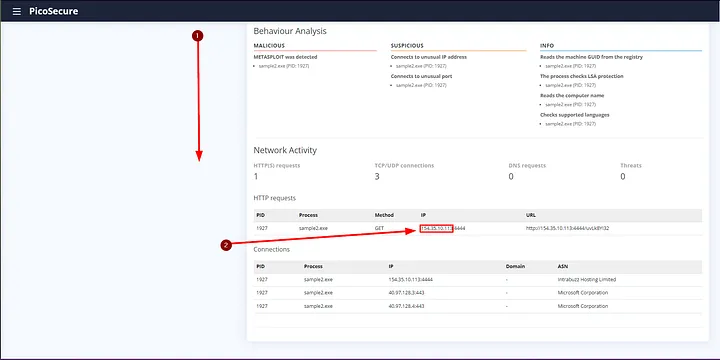

    Se analiza sample2.exe y se detecta tráfico hacia IP maliciosa 154.35.10.113.

    Se bloquea esta IP desde el firewall (regla egress con destino deny).

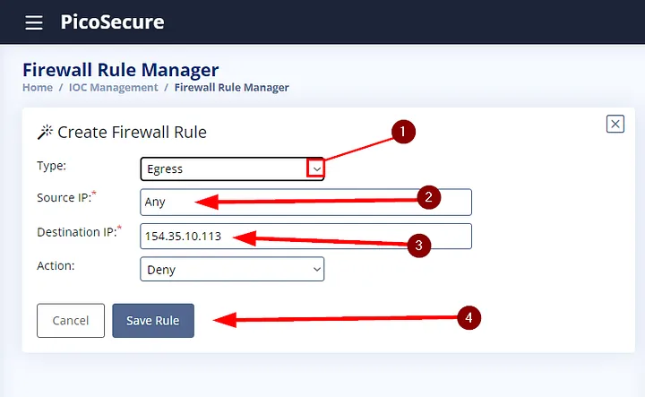

Flag: THM{2ff48a3421a938b388418be273f4806d}

- Sample 3 – Dominio

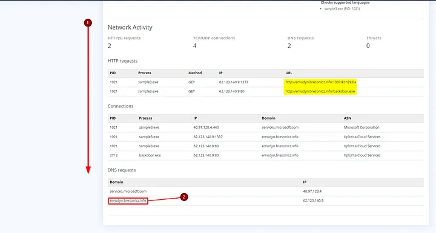

    sample3.exe contacta al dominio emudyn.bresonicz.info.

    Se bloquea el dominio con una regla en el filtro DNS.

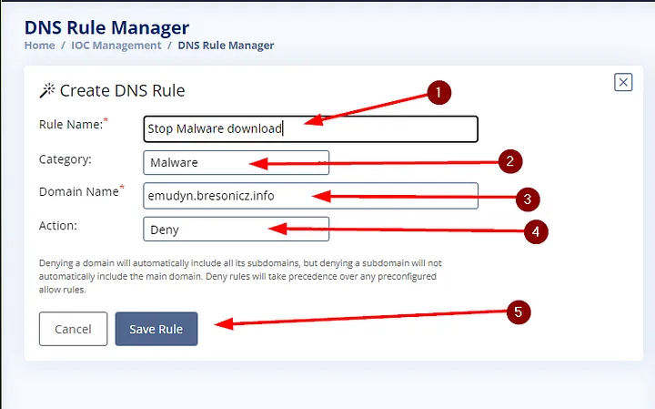

Flag: THM{4eca9e2f61a19ecd5df34c788e7dce16}

- Sample 4 – Modificación de Registro

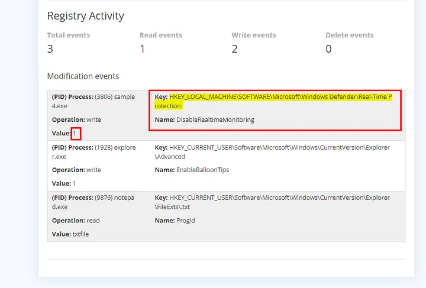

    sample4.exe desactiva Windows Defender modificando una clave de registro.

    Se crea una regla Sigma basada en eventos de Sysmon para detectar cambios en:
        HKEY_LOCAL_MACHINE\SOFTWARE\Microsoft\Windows Defender\Real-Time Protection
        Valor: DisableRealtimeMonitoring = 1
    MITRE: TA0005 – Defense Evasion

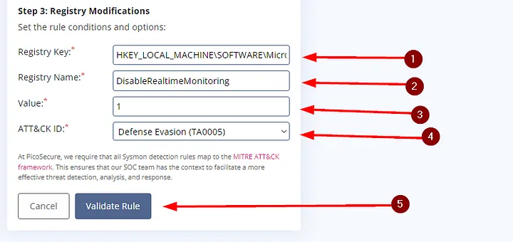

Flag: THM{c956f455fc076aea829799c0876ee399}

- Sample 5 – Patrón de conexiones

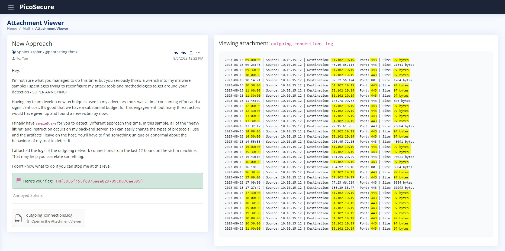

    Se analiza el archivo outgoing_connections.log.

    Se detecta conexión periódica cada 30 minutos al IP 51.102.10.19 por el puerto 443, con tamaño constante (97 bytes).

    Se genera una regla Sigma para detectar tráfico con ese patrón.

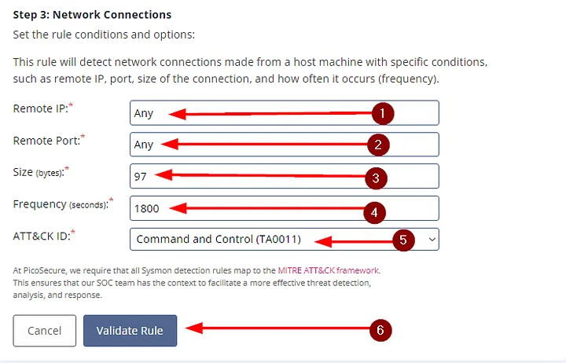

Flag: THM{46b21c4410e47dc5729ceadef0fc722e}

- Sample 6 – Exfiltración

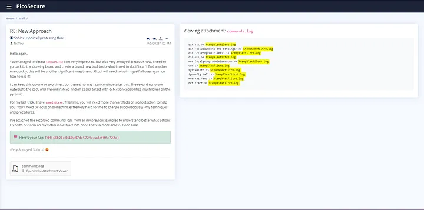

    Se analiza commands.log y se detecta exfiltración de datos al archivo exfiltr8.log en %temp%.

    Se crea una regla Sigma para detectar creación/modificación de archivos en esa ruta con ese nombre.

    MITRE ID: TA0010 – Exfiltration

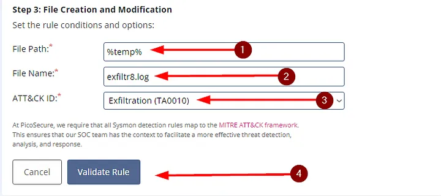

Flag Final: THM{c8951b2ad24bbcbac60c16cf2c83d92c}

